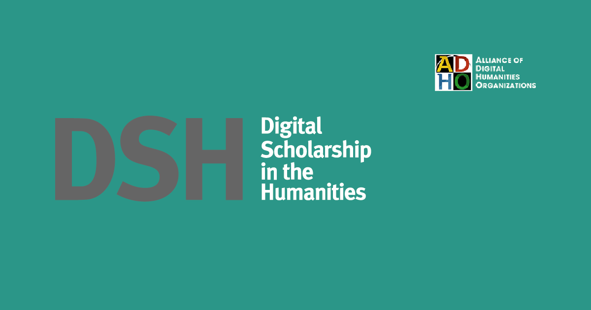
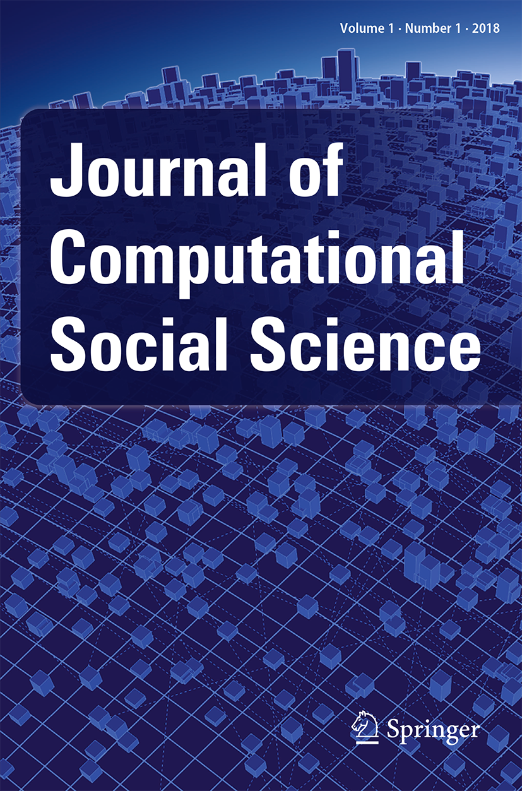
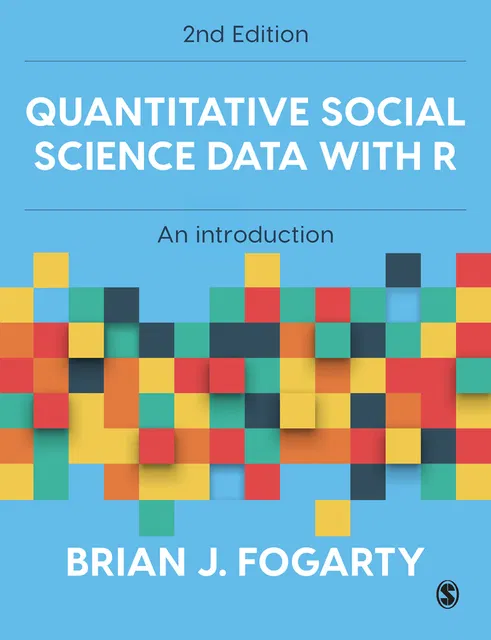
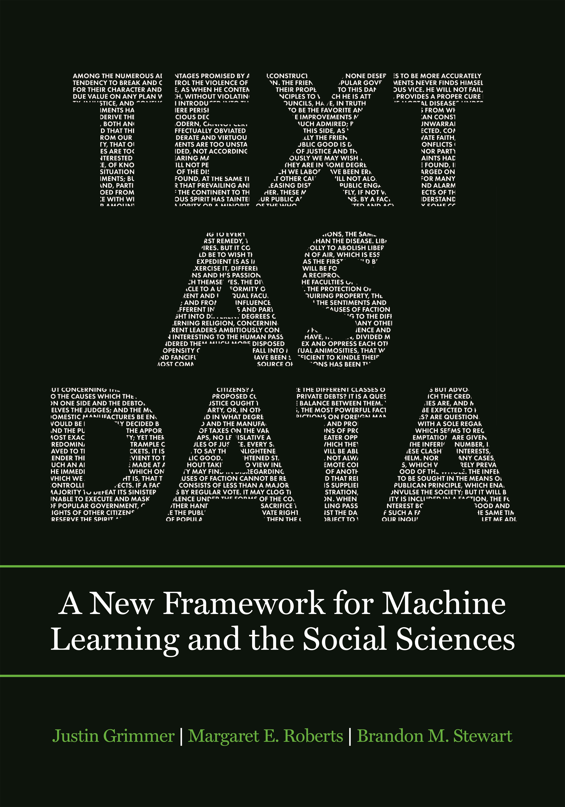

```{r}
SCRIPTS <- "scripts"

SCRIPTS |> file.path("import-corpus.R") |> source()

ggplot2::set_theme(ggthemes::theme_solarized())
```

# Outline

1. Why the 'Human Sciences'?
2. The Corpus
3. The Virtues of Computation

# Why the 'Human Sciences'?

## Digital HASS

::: {layout-ncol=4}









:::

## The problem of meaning {.smaller}

Dies alles verändert sich grundlegen, sobald wir in den Kreis des menschlichen Handelns eintreten. Dieses ist, selbst in seinen einfachsten und primitivisten Formen, durch eine Art der ‘Mittelbarkeit’ gekennzeichnet, die der Weise, in der das Tier reagiert, scharf entgegengesetzt ist. […] Diese ‘Vorstellung’ des Künftigen charakterisiert alles menschliche Handeln. Wir müssen ein noch nicht Bestehendes im ‘Bilde’ vor uns hinstellen, um sodann von dieser ‘Möglichkeit’ zur ‘Wirklichkeit’, von der Potenz zum Akt überzugehen. [@cassirer_zur_1980, 26]

> This all changes fundamentally, as soon as we step into the circle of human action. This is, even in its simplest and most primitive forms, known through a kind of 'mediation', which is completely opposed to the way in which an animal reacts. [...] This 'representation' of the future characterises all human action. We necessarily hold a picture before us of what has not yet happened, in order to move from 'possibility' to 'reality', from power to act.

# The Corpus

## Document Types

```{r}
#| label: tbl-document-types
#| tbl-caption: Most of the book chapters are in fact conference papers.
corpus |> 
  dplyr::group_by(type) |> 
  dplyr::count() |> 
  dplyr::arrange(desc(n)) |> 
  dplyr::rename(`Document Type` = type) |> 
  knitr::kable()
```

::: aside
Total documents: `r nrow(corpus)`
:::

## Disciplines Represented {.scrollable}

```{r}
#| label: tbl-discipline-tags
#| tbl-cap: Musicology is surprisingly well represented.
discipline_counts <- corpus_tags |> 
  dplyr::filter(tag_type == "Discipline") |> 
  dplyr::group_by(tag) |> 
  dplyr::count() |> 
  dplyr::arrange(desc(n)) |> 
  dplyr::rename(Discipline = tag)

discipline_counts|> 
  knitr::kable()
```

::: aside
`r corpus_tags |> dplyr::filter(tag_type == "Discipline") |> nrow()` discipline tags have been added to the documents (n = `r nrow(corpus)`).
:::

## Computers Represented {.smaller}

```{r}
#| label: fig-computers
#| fig-cap: "The graph reflects IBM's market dominance and early sponsorship of Humanities Computing."
corpus_tags |> 
  dplyr::filter(tag_type == "Computer") |> 
  dplyr::group_by(tag) |> 
  dplyr::count() |> 
  dplyr::ungroup() |> 
  dplyr::mutate(tag = dplyr::if_else(n == 1, "Other", tag)) |> 
  dplyr::group_by(tag) |> 
  dplyr::summarise(n = sum(n)) |> 
  ggplot2::ggplot(ggplot2::aes(x = tag, y = n)) +
  ggplot2::geom_col() +
  ggplot2::theme(axis.text.x = ggplot2::element_text(angle = 90, hjust = 1, vjust = 0.5)) +
  ggplot2::labs(x = "Computer")
```

::: aside
`r corpus_tags |> dplyr::filter(tag_type == "Computer") |> dplyr::distinct(id) |> nrow()` articles have computer tags. `r corpus_tags |> dplyr::filter(tag_type == "Computer") |> nrow()` distinct computers have been identified in the corpus.
:::

## The rise of minicomputers

```{r}
#| label: fig-manufacturers
#| fig-cap: Mainframes dominate the research in this corpus (IBM, Univac), but minicomputers start to become visible near the end.
corpus_tags |> 
  dplyr::filter(tag_type == "Computer") |> 
  dplyr::mutate(
    manufacturer = dplyr::case_when(
      stringr::str_starts(tag, "IBM") ~ "IBM",
      stringr::str_starts(tag, "Univac") ~ "Univac",
      stringr::str_starts(tag, "PDP") ~ "Digital Equipment Corporation",
      stringr::str_starts(tag, "CDC") ~ "Control Data Corporation",
      .default = "Other"
    )
  ) |> 
  dplyr::group_by(year, manufacturer) |> 
  dplyr::count() |> 
  ggplot2::ggplot(ggplot2::aes(color = manufacturer, x = year, y = n)) +
  ggplot2::geom_line() +
  ggplot2::geom_point(size = 1) +
  ggplot2::labs(x = "Year", y = "Computers Tagged", colour = "Manufacturer")
```

# The Virtues of Computation

## The computer and the clerk: metaphorically (1)

As you know by now, if you have been following these lectures, computers are not giant brains at all; they are giant clerks. [@green_using_1961, 227]

## The computer and the clerk: metaphorically (2)

Because the use of electronic computers has been regarded with skepticism, we should say quite clearly here that we regard a computer as [a clerk with several virtues]{.fragment .highlight-red} but one which is no better than its instructions. To appreciate the way in which this clerk operates, one should realize that a computer is, in principle, nothing more than a desk calculator and a note pad. [@gilbert_computer_1966, 71]

## The computer and the clerk: metaphorically (3)

It is useful to liken the Inquirer to an [energetic, compulsive, but stupid]{.fragment .highlight-current-red} clerk who has been trained in content analysis mechanics. This clerk has no ideas of his own but waits for the specification of categories and scoring procedures supplied by the investigator. Once these instructions are received and not found to be self-contradictory, the clerk is [able to apply them systematically to endless amounts of data]{.fragment .highlight-current-red}. [@stone_general_1966, 68]

## The computer and the clerk: literally (1)

We are still not thinking of the computer as anything but a myriad of clerks or assistants in one convenient console. Most of the results I  have just described could have been accomplished with the available means of half a century ago. We do not yet understand the true nature of the computer. And we have not yet begun to think in ways appropriate to the nature of this machine.[@milic_next_1966, 4]

## The computer and the clerk: literally (2)

This "feedback" process between the anthropologist and the programmer sometimes goes so far as to leave nothing to the former, in the way of interpretation. The computer then takes up not only the [clerical drudgery]{.fragment .highlight-red}, but also the more "intelligent" functions of problem-solving, in a very broad sense.[@gardin_reconstructing_1965]

## Keywords across the disciplines {.smaller}

```{r}
#| label: fig-select-keywords
#| fig-cap: Frequency for six possible keywords, in disciplines with >10 documents.

top_disciplines <- discipline_counts |> 
  dplyr::filter(n >= 10)
  
top_discipline_docs <- corpus_tags |> 
  dplyr::filter(tag_type == "Discipline") |> 
  dplyr::semi_join(top_disciplines, dplyr::join_by(tag == Discipline)) |> 
  dplyr::select(id, discipline = tag)

label_discipline <- function(label_df) {
  label_df |> 
    dplyr::left_join(discipline_counts, by = dplyr::join_by(discipline == Discipline)) |> 
    dplyr::transmute(
      tag = glue::glue("{discipline} (n={n})")
    )
}

corpus_words |> 
  dplyr::right_join(top_discipline_docs, by = "id") |> 
  dplyr::group_by(discipline, word) |> 
  dplyr::count() |> 
  dplyr::group_by(discipline) |> 
  dplyr::mutate(freq = n / sum(n) * 1000) |> 
  dplyr::filter(word %in% c("speed", "accuracy", "complete", "index", "method", "concordance")) |> 
  ggplot2::ggplot(ggplot2::aes(x = word, y = freq)) +
  ggplot2::geom_col() +
  ggplot2::facet_wrap(ggplot2::vars(discipline), labeller = label_discipline) +
  ggplot2::theme(axis.text.x = ggplot2::element_text(angle = 45, hjust = 1, vjust = 1)) +
  ggplot2::labs(x = "Word", y = "Frequency (per 1000 words)")
```

::: aside
There are `r dplyr::distinct(top_discipline_docs, id) |> nrow()` documents in this subset; `r dplyr::group_by(top_discipline_docs, id) |> dplyr::count() |> dplyr::filter(n > 1) |> nrow()` have been assigned to more than one discipline.
:::

## Distinctive Vocabulary

```{r}

key_disciplines <- corpus_tags |> 
  dplyr::filter(tag_type == "Discipline", tag %in% c("Psychology","Literary Studies", "Behavioural science" ,"Musicology")) |> 
  dplyr::select(id, discipline = tag)

tf_idf <- corpus_words |> 
  dplyr::anti_join(tidytext::stop_words, by = "word") |> 
  dplyr::filter(!stringr::str_detect(word, "[:digit:]")) |> 
  dplyr::right_join(key_disciplines, by = "id", relationship = "many-to-many") |> 
  dplyr::group_by(discipline, word) |> 
  dplyr::count() |> 
  tidytext::bind_tf_idf(word, discipline, n)
```

```{r}
#| label: fig-tfidf
#| fig-cap: Most distinctive words by discipline, by tf-idf

tf_idf |> 
  dplyr::group_by(discipline) |> 
  dplyr::slice_max(n = 15, order_by = tf_idf) |> 
  dplyr::ungroup() |> 
  dplyr::mutate(word = reorder(word, tf_idf)) |> 
  ggplot2::ggplot(ggplot2::aes(x = tf_idf, y = word)) +
  ggplot2::geom_col() +
  ggplot2::facet_wrap(ggplot2::vars(discipline), scales = "free_y", labeller = label_discipline)
```
## Changing the object: "intervallic" {.smaller}

```{r}
# Function from Faerie Queene chapter
construct_term_graph <- function(word_cors, terms, order = 2, threshold = .1) {
  # Filter out weak correlations
  word_cors <- dplyr::filter(word_cors, correlation >= threshold)
  
  # Construct graph
  cor_graph <- igraph::graph_from_data_frame(word_cors)
  
  # Get subgraph on terms of interest
  term_vertices <- igraph::V(cor_graph)[name %in% terms]
  neighbour_vertices <- igraph::neighborhood(cor_graph, nodes = term_vertices, order = order)
  neighbour_ids <- purrr::map(neighbour_vertices, igraph::as_ids) |> purrr::flatten_chr()
  term_graph <- igraph::subgraph(graph = cor_graph, vids = neighbour_ids)
  
  return(term_graph)
}

visualise_term_graph <- function(term_graph) {
  term_graph |> ggraph::ggraph(layout = "fr") +
    ggraph::geom_edge_link(ggplot2::aes(edge_width = correlation), show.legend = FALSE, edge_alpha = 0.1) +
    ggraph::geom_node_point(colour = "lightblue", size = 5) +
    ggraph::geom_node_text(ggplot2::aes(label = name), repel = TRUE) +
    ggplot2::theme(
      panel.grid.major = ggplot2::element_blank(),
      panel.grid.minor = ggplot2::element_blank()
    )
}
```


```{r}
compute_word_correlations <- function(tidy_corpus, corpus_tags, chunk_size, discipline) {
  
  if (discipline != "any") {
    disc_corpus <- tidy_corpus |> 
      dplyr::semi_join(
      dplyr::filter(corpus_tags, tag_type == "Discipline", tag == discipline),
      by = "id"
    )
  } else {
    disc_corpus <- tidy_corpus
  }
  
  disc_corpus |> 
    # Filter unwanted words
    dplyr::anti_join(tidytext::stop_words, by = "word") |> 
    dplyr::group_by(word) |> 
    dplyr::filter(dplyr::n() >= 5) |> 
    # Chunk the documents, filter small chunks
    dplyr::group_by(id) |> 
    dplyr::mutate(
      chunk = seq_along(word) %/% chunk_size + 1,
      chunk = stringr::str_c(id, chunk, sep="_")
    ) |> 
    dplyr::group_by(chunk, word) |> 
    dplyr::count() |> 
    dplyr::group_by(chunk) |> 
    dplyr::filter(sum(n) > (chunk_size / 2)) |> 
    widyr::pairwise_cor(word, chunk, n, sort = TRUE)
}
```

```{r}
#| label: fig-intervallic-correlations
#| fig-cap: The concept of 'intervallic' becomes statistical in the Musicology articles.

musicology_cors <- compute_word_correlations(corpus_words, corpus_tags, 200, "Musicology")

construct_term_graph(musicology_cors, "intervallic", order = 2, threshold = 0.5) |> 
  visualise_term_graph()
```

::: aside
How does the actual object of study change when it is modelled on the computer?
:::

## The meaning of "experiment": Psychology {.smaller}

```{r}
#| label: fig-psychology-correlations
#| fig-cap: Most highly correlated words with "experiment" and its neighbours, in 200-word chunks from the Psychology articles.
psych_cors <- compute_word_correlations(corpus_words, corpus_tags, chunk_size = 200, discipline = "Psychology")

construct_term_graph(psych_cors, "experiment", order = 2, threshold = 0.3) |> 
  visualise_term_graph()
```

## The meaning of "experiment": Literary Studies {.smaller}

```{r}
#| label: fig-literatre-correlations
#| fig-cap: Most highly correlated words with "experiment" and its neighbours, in 200-word chunks from the Literary Studies articles.
english_cors <- compute_word_correlations(corpus_words, corpus_tags, chunk_size = 200, discipline = "Literary Studies")

construct_term_graph(english_cors, "experiment", order = 2, threshold = 0.35) |> 
  visualise_term_graph()
```

## References {.smallest}
